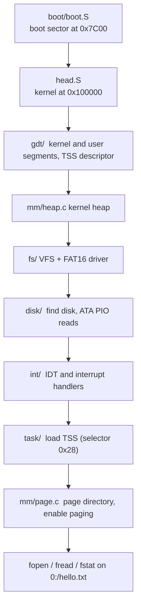

# soOS

A 32-bit x86 kernel written from the boot sector up, for the BUPT operating systems lab (spring 2024).

It boots from a raw disk image in QEMU and brings up what a kernel needs before it can load anything: segment descriptors and a TSS, a kernel heap, an ATA disk driver, a FAT16 file system behind a small VFS, interrupt handling, and paging. The demo at the end of `main.c` maps a heap page at virtual address `0x1000`, writes through it, and reads `0:/hello.txt` from the disk image.



## Layout

| Directory | What's in it |
|---|---|
| `boot/` | Boot sector: load the kernel, enter protected mode |
| `gdt/`, `task/` | GDT built from readable structs; TSS setup and `ltr` |
| `int/` | IDT setup, interrupt stubs in assembly, handlers in C |
| `mm/` | 4 KiB paging with per-page flags; a block-based kernel heap |
| `disk/` | ATA PIO sector reads through ports `0x1F0`–`0x1F7`, seekable disk streams |
| `fs/` | Path parser, VFS dispatch, FAT16 directory walk and cluster chains |
| `lib/` | `print`, `memset` and string helpers (no libc) |

## Build and run

Needs `gcc` with 32-bit support, GNU binutils, `make`, `sudo` (the build mounts the image to copy `hello.txt` in), and `qemu-system-i386`. The lab report lists the exact environment.

```bash
make run      # build image/disk.img and boot it in QEMU
make debug    # boot paused with a GDB stub (see .gdbinit)
```

## Project notes

- Lab project; I led the design and implementation. The full write-up with design notes and test screenshots is in `lab-report.pdf` (Chinese).
- The accepted version is on the `Acceptance_result` branch.
- References: the [OSDev wiki](https://wiki.osdev.org/) for descriptor formats and the FAT16 layout.

## Stack

C, x86 assembly (GNU as), GNU Make, QEMU, GDB.
